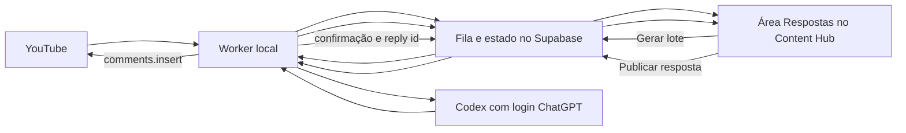

# Design: copiloto de respostas a comentários do YouTube com Codex via ChatGPT

Data: 2026-07-14

Status: desenho aprovado por Bruno; somente esta especificação foi autorizada

Implementação: depende de autorização separada

Credenciais, OAuth, Supabase hospedado e produção: dependem de autorização específica antes de cada mudança

## 1. Contexto

O Content Hub já possui quatro peças úteis, porém desconectadas para este caso:

- a aplicação privada de Inteligência Comercial, hospedada em Cloudflare Pages e autenticada pelo Supabase;
- sincronização de vídeos e métricas do YouTube em Supabase Edge Functions;
- leitura local de comentários do YouTube em `server/services/comments.ts`;
- uma interação de sugestão, edição e resposta para comentários do Instagram.

A leitura local atual de comentários não serve como base operacional da nova funcionalidade. Ela grava JSON no disco, pode chamar Gemini quando encontra `GOOGLE_AI_STUDIO_API_KEY`, não mantém uma fila transacional e não publica respostas no YouTube. O fluxo do Instagram também usa Gemini e uma API diferente. A nova funcionalidade pode reaproveitar o padrão de experiência, mas não o provedor de IA nem o contrato de publicação.

O rastreamento comercial já possui campanhas por vídeo com `cta_position = 'comment_reply'`. Essas campanhas fornecem o link público `-r` que deve acompanhar as respostas elegíveis. O worker não construirá o link manualmente nem usará o endereço antigo da landing page.

Bruno não quer copiar e colar comentários ou respostas, não quer pagar por uma API externa e não autoriza publicação automática. A IA escolhida é o Codex, autenticado pela conta ChatGPT de Bruno e executado numa máquina local confiável.

## 2. Objetivos

Criar uma área `Respostas` dentro da Inteligência Comercial que permita:

- sincronizar comentários novos de vídeos longos do canal;
- importar comentários históricos em lotes controlados;
- identificar comentários elegíveis, já respondidos, dispensáveis ou sensíveis;
- gerar uma resposta individual no tom de Bruno;
- recomendar o MAPA-7P em todos os comentários elegíveis;
- usar o link rastreável `-r` específico do vídeo;
- editar, regenerar, pular ou publicar cada resposta;
- publicar somente após uma ação específica de Bruno;
- confirmar no YouTube que a resposta foi criada;
- aprender com as versões finais aprovadas sem formar perfis clínicos dos comentaristas;
- registrar evidências sanitizadas dos testes e do piloto.

## 3. Fora do escopo

- publicação automática ou aprovação em massa;
- publicação de respostas em lote;
- respostas a Shorts na primeira versão;
- alteração automática de descrições ou comentários fixados;
- moderação, ocultação ou exclusão de comentários;
- diagnóstico, triagem clínica individual ou orientação de medicamento;
- perfil longitudinal de saúde de comentaristas;
- treinamento ou fine-tuning de modelo;
- uso de Gemini, OpenAI Platform API ou qualquer fallback pago;
- integração equivalente para Instagram nesta entrega;
- alteração do portal de membros;
- alteração dos links, da landing page ou das regras atuais de atribuição;
- mudanças em credenciais, OAuth, webhook, Supabase hospedado ou produção sem autorização posterior.

## 4. Abordagens consideradas

### 4.1 Extensão do servidor local e arquivos JSON

Seria a alternativa mais rápida, aproveitando `server/services/comments.ts`. Foi rejeitada porque depende do servidor Express local, não fornece fila confiável, não oferece acesso hospedado e dificulta idempotência, auditoria e retomada de falhas.

### 4.2 Copiloto híbrido com Supabase e worker local — escolhida

O Content Hub hospedado mantém inbox, fila, rascunhos, decisões e auditoria. Um worker local autenticado executa Codex e as operações de comentários do YouTube. Essa separação preserva a experiência hospedada, evita a OpenAI Platform API e mantém os tokens ChatGPT fora de Supabase e Cloudflare.

### 4.3 IA e publicação totalmente hospedadas

Exigiria API paga ou transferência de credenciais de conta para um ambiente remoto. A publicação automática também retiraria de Bruno a autoridade final sobre cada comentário. Foi rejeitada.

## 5. Arquitetura escolhida



### 5.1 Content Hub hospedado

A aplicação continua sendo a superfície de controle. Ela não chama um modelo diretamente e não recebe token ChatGPT.

Responsabilidades:

- autenticar Bruno pela infraestrutura existente;
- exibir comentários, rascunhos e estados;
- criar solicitações de sincronização e geração;
- registrar edições, pulos e pedidos de publicação;
- impedir ações de escrita para usuários sem papel `admin`;
- mostrar o último heartbeat do worker;
- apresentar erros sem expor credenciais ou payloads internos.

### 5.2 Supabase

O Supabase atua como fila durável e fonte de estado. Nenhuma chamada ao Codex ocorre em Edge Function.

Responsabilidades:

- persistir comentários enquanto estiverem dentro da política de retenção;
- coordenar leases de jobs para evitar processamento concorrente;
- manter rascunho, versão final e transições de estado;
- aplicar autenticação, autorização e idempotência;
- fornecer ao frontend apenas os campos necessários;
- expirar ou atualizar dados de origem do YouTube.

As tabelas novas permanecem com RLS habilitada e acesso direto revogado para `anon` e `authenticated`, seguindo o padrão atual da Inteligência Comercial. Edge Functions usam `service_role`; navegador e worker acessam somente endpoints autorizados.

### 5.3 Worker local

O worker será um processo TypeScript executado na máquina de Bruno. Ele permanece opcionalmente aberto e consulta a fila em intervalos curtos. Se estiver desligado, os jobs continuam armazenados e nenhuma ação externa ocorre.

Responsabilidades:

- autenticar no Content Hub como membro `admin` sem possuir `service_role`;
- atualizar heartbeat;
- sincronizar comentários do YouTube;
- montar contexto e recuperar exemplos de voz;
- executar o Codex;
- validar respostas de forma determinística;
- publicar apenas jobs explicitamente solicitados;
- reler o thread antes e depois da publicação;
- gravar resultados e erros sanitizados.

O worker usa a sessão Supabase do próprio Bruno. A autenticação local deve guardar somente o refresh token da sessão no armazenamento de credenciais do Windows; a senha não é persistida.

### 5.4 Codex com autenticação ChatGPT

A integração preferencial é o SDK TypeScript oficial `@openai/codex-sdk`, com runtime local. Um spike técnico deve validar essa rota no Windows antes da implementação completa.

O worker usa um `CODEX_HOME` isolado, por exemplo `%LOCALAPPDATA%\OpenSquad\content-hub-codex`, com:

- `forced_login_method = "chatgpt"`;
- `cli_auth_credentials_store = "keyring"`;
- nenhuma configuração MCP, plugin ou ferramenta externa;
- diretório de trabalho dedicado e sem arquivos do repositório;
- sandbox somente leitura;
- uma sessão efêmera por comentário.

O processo remove `OPENAI_API_KEY` e `CODEX_API_KEY` do ambiente antes de iniciar o Codex e aborta se o método ativo não for ChatGPT. Não existe fallback para API key.

O executável empacotado no aplicativo Codex retornou `Acesso negado` quando chamado diretamente pelo PowerShell durante a análise. Isso não será tratado como sucesso presumido. O spike deve testar o runtime distribuído pelo SDK ou uma instalação oficial independente. Se ambos falharem, o trabalho para nessa etapa e o bloqueio é apresentado a Bruno.

### 5.5 YouTube

Leitura e publicação de comentários são executadas pelo worker, usando um token OAuth específico para respostas. O token atual de Analytics não será sobrescrito.

A configuração posterior deve:

- reutilizar o cliente Google somente se isso não afetar os fluxos atuais;
- solicitar o escopo necessário para `comments.insert`;
- armazenar o refresh token de respostas localmente, no cofre de credenciais;
- nunca enviar esse refresh token ao Supabase;
- exigir nova autorização de Bruno antes do consentimento OAuth.

Cada publicação custa quota da YouTube Data API. O worker registra o número de tentativas e nunca repete automaticamente uma publicação de resultado incerto.

## 6. Modelo de dados conceitual

### 6.1 `ci_youtube_comments`

Uma linha por comentário ou resposta observada.

Campos principais:

- `comment_id` — identificador do YouTube;
- `thread_id` — thread de origem;
- `parent_id` — nulo para comentário principal;
- `video_id`;
- `author_channel_id` e `author_display_name`, sujeitos a expiração;
- `text_original`, sujeito a expiração;
- `like_count`;
- `published_at` e `updated_at` da origem;
- `is_channel_owner`;
- `has_owner_reply`;
- `source_kind` — `new` ou `historical`;
- `eligibility_status`;
- `block_reason`;
- `source_refreshed_at` e `source_expires_at`.

Somente comentários principais podem virar alvo de resposta na primeira versão. Respostas existentes são armazenadas temporariamente para compor o contexto e detectar atendimento anterior.

### 6.2 `ci_youtube_reply_jobs`

Representa geração ou publicação associada a um comentário.

Campos principais:

- `job_id`;
- `comment_id`;
- `job_type` — `sync`, `generate` ou `publish`;
- `status`;
- `lease_owner` e `lease_expires_at`;
- `attempt_count`;
- `prompt_version`;
- `provider` fixo `codex_chatgpt`;
- `model_observed`, quando informado pelo runtime;
- `reply_mode`;
- `draft_text`;
- `final_text`;
- `final_text_hash`;
- `campaign_id` e `tracked_url_snapshot`;
- `published_reply_id`;
- `error_code` e mensagem sanitizada;
- timestamps de criação, geração, solicitação de publicação e confirmação.

Restrições impedem mais de um job ativo de geração e mais de uma publicação confirmada para o mesmo comentário.

### 6.3 `ci_youtube_reply_events`

Registro append-only das transições operacionais, sem texto bruto do comentário ou credenciais.

Exemplos:

- comentário capturado;
- elegibilidade calculada;
- geração solicitada;
- rascunho criado;
- edição salva;
- publicação solicitada;
- publicação confirmada;
- job bloqueado ou pulado.

### 6.4 `ci_youtube_reply_examples`

Corpus privado de exemplos aprovados.

Campos principais:

- resumo desidentificado do comentário;
- categoria operacional;
- modo de recomendação do MAPA;
- resposta final aprovada;
- origem `curated_history` ou `approved_edit`;
- estado `active` ou `excluded`;
- data e versão das regras.

Nomes, URLs, identificadores e detalhes clínicos desnecessários são removidos antes da persistência. O corpus inicial terá entre 30 e 50 exemplos selecionados do histórico; não usará indiscriminadamente as 1.385 respostas do CSV.

### 6.5 `ci_reply_worker_heartbeats`

Guarda identificador local do worker, versão, estado, job atual e último heartbeat. Não guarda token ChatGPT, token YouTube ou credencial Supabase.

## 7. Estados e concorrência

Estados operacionais:

```text
captured
  -> eligible | manual_review | skipped | already_answered
eligible
  -> queued_generation
queued_generation
  -> generating -> draft_ready | manual_review | generation_failed
draft_ready
  -> queued_generation | skipped | publish_requested
publish_requested
  -> publishing -> published | publish_failed | already_answered
```

Regras:

- um worker reivindica job por RPC atômica e recebe lease temporário;
- heartbeat prolonga o lease enquanto o job está ativo;
- lease expirado volta à fila somente para sincronização ou geração;
- publicação não é repetida automaticamente após resultado incerto;
- um novo pedido de geração cria nova versão sem apagar o rascunho anterior;
- `final_text_hash` garante que o texto publicado é exatamente o texto aprovado;
- transições inválidas retornam conflito e não alteram estado.

## 8. Sincronização de comentários

### 8.1 Comentários novos

A interface oferece `Sincronizar comentários`. A sincronização automática periódica fica desligada na primeira versão e pode ser adicionada depois, com autorização própria.

O worker:

1. consulta threads recentes do canal em ordem temporal;
2. para ao alcançar o watermark já conhecido;
3. grava comentários novos de forma idempotente;
4. busca a lista completa de respostas quando o resumo do thread for insuficiente;
5. marca comentários do próprio canal;
6. identifica thread que já possui resposta do canal;
7. associa o comentário ao catálogo local de vídeos;
8. exclui Shorts da inbox operacional.

### 8.2 Histórico

O primeiro lote contém os vinte comentários mais recentes ainda sem resposta, em vídeos longos. Depois da calibração, a interface libera lotes de cinquenta.

Filtros obrigatórios:

- `content_type = 'long'`;
- comentário principal;
- não escrito pelo próprio canal;
- sem resposta existente do canal;
- não importado anteriormente;
- não apagado ou indisponível;
- não identificado como spam determinístico.

O lote gera rascunhos, nunca publicações em massa.

### 8.3 Consistência do thread

`commentThread.replies` pode ser parcial. Antes da geração e novamente antes da publicação, o worker usa a lista completa de respostas do comentário principal quando necessário. Isso evita oferecer o MAPA duas vezes ou responder a uma conversa que Bruno já atendeu.

## 9. Resolução do link rastreável

Para cada comentário elegível, o backend consulta `ci_campaigns` por:

- `video_id` do comentário;
- `cta_position = 'comment_reply'`;
- `status = 'active'`.

Deve existir exatamente uma campanha ativa. O rascunho recebe o `redirectUrl` público dessa campanha, por exemplo:

```text
https://link.brunosallesphd.com.br/m7p/<video>-r
```

Se não houver campanha, se houver mais de uma campanha ativa ou se o domínio não estiver na allowlist, o comentário vai para `manual_review` com `campaign_missing`, `campaign_ambiguous` ou `campaign_url_invalid`. O worker não inventa slug e não usa HotLink direto ou o link antigo da KPages.

## 10. Fontes de voz e hierarquia

Ordem de autoridade:

1. segurança clínica, consentimento e políticas da plataforma;
2. fatos canônicos do MAPA-7P;
3. `regras_formatacao_respostas_v2 (2).md`;
4. `.claude/skills/roteiro_claude/_ref/voz.md`;
5. exemplos aprovados recuperados para aquele comentário.

Essa ordem resolve conflitos observados nas fontes:

- `cê` permanece proibido, mesmo aparecendo no vocabulário geral de `voz.md`;
- a duração canônica é aproximadamente 25 minutos, substituindo menções antigas a menos de 20 minutos;
- o link fixo antigo é substituído pelo link `-r` do vídeo;
- a exigência de bloco Markdown pertencia ao fluxo manual de copiar e colar e não aparece na resposta publicada;
- o MAPA é obrigatório em 100% dos comentários elegíveis, não em casos bloqueados.

O arquivo de regras de comentários é a fonte primária de estilo. `voz.md` adiciona repertório e ritmo, mas não pode revogar uma regra específica do canal de comentários.

## 11. Fatos canônicos do MAPA-7P

O prompt pode afirmar somente que o MAPA é:

- uma avaliação estruturada online de TDAH para adultos;
- realizada de casa;
- concluída em aproximadamente 25 minutos;
- útil para organizar sinais e ajudar a decidir o próximo passo;
- útil também para quem já possui diagnóstico e quer observar o momento atual;
- não equivalente a diagnóstico.

Cada resposta usa no máximo um benefício diretamente relacionado ao comentário. Alegações como precisão diagnóstica, validação científica específica, garantia de resultado, prevenção de risco ou recomendação terapêutica exigem fonte e aprovação antes de entrar no prompt.

## 12. Pipeline de IA

### 12.1 Preparação do contexto

Cada execução recebe somente:

- comentário como dado não confiável;
- respostas do thread necessárias ao contexto;
- título e metadados do vídeo;
- resumo ou trecho de transcrição local, quando disponível;
- fatos canônicos do MAPA;
- regras de voz normalizadas;
- três a cinco exemplos desidentificados recuperados por semelhança lexical, categoria e modo;
- link `-r` validado.

O worker não envia o banco completo, o CSV histórico, segredos, e-mails, arquivos `.env` ou perfis de outros comentaristas.

### 12.2 Isolamento contra prompt injection

O texto do comentário é delimitado e tratado como conteúdo, nunca como instrução. O Codex roda:

- em diretório dedicado sem código ou segredo;
- sem MCP, plugins ou conectores;
- sem permissão de escrita;
- sem ferramenta de shell necessária à tarefa;
- com schema de saída estrito;
- em sessão efêmera independente.

Comentários excessivamente longos, com comandos, links suspeitos ou tentativa de alterar regras recebem flag operacional e podem ser enviados para revisão manual.

### 12.3 Saída estruturada

Contrato conceitual:

```json
{
  "eligibility": "eligible",
  "blockReason": null,
  "replyMode": "clarity",
  "draft": "Texto da resposta",
  "usedTrackedUrl": "https://link.brunosallesphd.com.br/m7p/video-r",
  "warnings": []
}
```

Valores de `replyMode`:

- `complement`;
- `clarity`;
- `mirror`;
- `maintenance`;
- `silent_support`;
- `reference_for_others`.

Uma execução trata somente um comentário. A concorrência inicial é um para preservar qualidade, facilitar auditoria e medir o consumo real do plano ChatGPT.

### 12.4 Validação determinística

Depois da geração, código local verifica:

- máximo de 180 palavras;
- parágrafos curtos e ausência de bullets;
- ausência de `cê`, travessão e abertura com `Oi`;
- dois-pontos somente quando permitido pela regra de link;
- emoji opcional apenas no fechamento;
- exatamente um link e igualdade exata com o `tracked_url`;
- presença de explicação do que é o MAPA antes ou junto do nome;
- presença explícita de que não é diagnóstico quando a formulação puder gerar ambiguidade;
- ausência de diagnóstico, prescrição, dosagem e promessa;
- ausência de afirmação fora dos fatos canônicos;
- resposta direta ao comentário antes da recomendação;
- similaridade de trigramas abaixo de 50% contra rascunhos recentes e exemplos ativos.

Falha de validação autoriza somente uma regeneração automática. Se a segunda versão falhar, o job vai para `manual_review`; não há loop de consumo do plano.

## 13. Elegibilidade e segurança

### 13.1 Elegíveis

Comentários substanciais, positivos, de identificação, dúvida, relato, agradecimento ou testemunho podem receber o MAPA, desde que não caiam nas exceções abaixo.

### 13.2 Revisão manual sem oferta obrigatória

- risco de suicídio, automutilação ou emergência;
- pedido de dosagem, interrupção ou troca de medicamento;
- relato explícito de menor de idade;
- emergência médica ou psiquiátrica;
- comprador pedindo suporte, reembolso ou reclamando do MAPA;
- comentário abusivo, spam, golpe ou conteúdo sem sinal suficiente;
- comentário já respondido pelo canal;
- thread em que o MAPA já foi oferecido;
- dúvida de elegibilidade ou contexto incompleto.

O sistema não gera automaticamente uma resposta comercial nesses casos. A classificação é operacional e transitória; não é diagnóstico nem perfil clínico.

### 13.3 Autoridade final

Nenhum rascunho é publicação. O único comando que cria uma resposta externa é `Publicar no YouTube`, acionado individualmente por Bruno sobre um texto visível e editável.

## 14. Aprendizado com as edições

Quando Bruno publica uma versão editada:

1. a versão final é registrada como resposta aprovada;
2. nomes, URLs, IDs e detalhes clínicos desnecessários são removidos do exemplo;
3. um resumo operacional do tipo de comentário é armazenado;
4. o exemplo passa a concorrer na recuperação futura;
5. Bruno pode excluir o exemplo do corpus sem apagar o histórico da publicação.

Não há ajuste de pesos do modelo. A melhoria ocorre por recuperação de exemplos, versionamento do prompt e análise das diferenças entre rascunho e versão final.

## 15. Interface

### 15.1 Navegação

Adicionar uma aba `Respostas` a `StandaloneCommercialIntelligenceView`. A aba fica visível somente para `admin`, porque pode conter relatos pessoais e ações de publicação.

### 15.2 Cabeçalho operacional

Exibir:

- worker `online`, `ocupado`, `offline` ou `autenticação necessária`;
- último heartbeat;
- comentários novos;
- rascunhos aguardando revisão;
- bloqueados para revisão manual;
- falhas de geração ou publicação;
- ações `Sincronizar comentários` e `Gerar lote`.

### 15.3 Card de comentário

Cada card contém:

- thumbnail, título e preview expansível do vídeo;
- indicador `novo` ou `histórico`;
- nome exibido, data, likes e comentário completo;
- contexto do thread recolhível;
- estado de elegibilidade e motivo quando bloqueado;
- editor do rascunho;
- modo usado para recomendar o MAPA;
- link rastreável em leitura;
- avisos do validador;
- ações `Regenerar`, `Pular` e `Publicar no YouTube`.

`Publicar no YouTube` permanece desabilitado quando o worker está offline, o comentário está desatualizado, o link não é válido ou o texto não passou no linter.

### 15.4 Filtros

- novos ou históricos;
- vídeo;
- período;
- estado;
- elegível ou revisão manual;
- rascunho, publicado ou pulado.

Não existe seleção múltipla para publicar.

## 16. API interna

Contratos conceituais autenticados:

```text
GET  /functions/v1/ci-youtube-replies?status=&videoId=&source=&cursor=
POST /functions/v1/ci-youtube-replies/actions
POST /functions/v1/ci-youtube-replies/worker
```

Ações da interface:

- `request_sync`;
- `request_generation_batch`;
- `request_regeneration`;
- `save_edit`;
- `skip`;
- `request_publish`;
- `exclude_example`.

Ações do worker:

- `heartbeat`;
- `claim_job`;
- `complete_sync`;
- `complete_generation`;
- `complete_publish`;
- `fail_job`.

Todas as mutações exigem papel `admin`. O endpoint valida tamanho, estado esperado, versão e `final_text_hash`. Mensagens de erro externas são sanitizadas.

## 17. Publicação e idempotência

Ao receber `publish_requested`, o worker:

1. confirma que o hash do texto coincide com a versão aprovada;
2. atualiza os dados do comentário e o thread;
3. cancela se o comentário desapareceu ou já recebeu resposta do canal;
4. executa novamente todos os validadores;
5. chama `comments.insert` com `parentId` e `textOriginal`;
6. guarda a resposta retornada;
7. relê a resposta no YouTube;
8. grava `published_reply_id` e `published_at`;
9. marca o job como `published`.

Se a conexão cair depois do envio e antes da confirmação, o worker procura uma resposta do canal com o mesmo hash normalizado. Não encontrando evidência suficiente, marca `publish_unknown` e exige decisão manual. Nunca repete a chamada automaticamente nesse estado.

## 18. Privacidade, retenção e conformidade

- o usuário mantém autoridade final sobre cada inserção;
- comentários enviados ao Codex são processados sob a conta e as regras do workspace ChatGPT de Bruno;
- antes do primeiro lote real, Bruno recebe a descrição exata dos campos enviados, número esperado de chamadas e impacto na franquia;
- texto, autor e contexto do comentário são atualizados ou eliminados dentro da janela aplicável da YouTube Data API;
- registros ativos possuem `source_refreshed_at` e `source_expires_at`;
- eventos de auditoria não guardam texto clínico bruto;
- exemplos permanentes são desidentificados;
- não há perfil longitudinal, inferência persistente de diagnóstico ou agregação por pessoa;
- uma política de privacidade e tratamento de dados compatível com YouTube e OpenAI é pré-requisito para produção;
- secrets e tokens nunca aparecem em logs ou evidências.

## 19. Tratamento de erros

- worker offline: fila aguarda e a interface informa o último heartbeat;
- login ChatGPT ausente ou expirado: worker pausa e solicita autenticação local;
- método de login diferente de ChatGPT: worker aborta;
- limite do plano Codex: jobs permanecem na fila sem fallback pago;
- saída inválida: uma regeneração e depois revisão manual;
- campanha `-r` ausente ou ambígua: revisão manual;
- comentário removido ou desabilitado: `source_unavailable`;
- resposta preexistente do canal: `already_answered`;
- erro OAuth YouTube: publicação não é repetida e solicita reautenticação;
- quota YouTube insuficiente: publicação fica pendente até intervenção;
- resultado de publicação incerto: `publish_unknown`, sem retry automático;
- lease abandonado em geração: job volta à fila após expiração;
- sessão Supabase expirada: worker renova o token ou pausa;
- texto maior que o limite operacional: revisão manual;
- dado ou erro inesperado: mensagem sanitizada para a interface e detalhe técnico somente no log local protegido.

## 20. Riscos e mitigação

| Risco | Mitigação |
| --- | --- |
| O runtime Codex autenticado pelo ChatGPT não funcionar de forma programática neste Windows | Spike isolado antes de banco, UI ou OAuth do YouTube; sem fallback pago |
| O plano ChatGPT atingir limite de uso durante um lote | Concorrência igual a um, fila durável, pausa explícita e retomada posterior |
| O Codex produzir texto tecnicamente válido, mas pouco natural para comentários | Modo sombra com vinte comentários, corpus curado e gate mínimo de 80% aproveitável |
| Muitas respostas com o mesmo domínio serem tratadas como spam pelo YouTube | Publicação individual, sem rajada, variação real de texto, piloto pequeno e conferência também fora da sessão do canal |
| O computador ficar desligado ou o worker cair | Jobs permanecem no Supabase; leases expiram sem perder rascunho ou provocar publicação |
| Um comentário tentar instruir o agente ou acessar ferramentas | Comentário tratado como dado não confiável, runtime isolado, sem MCP, sem shell e com schema estrito |
| O histórico conter respostas antigas de IA que não representam fielmente Bruno | Seleção manual de 30 a 50 exemplos e exclusão reversível de qualquer exemplo ruim |
| O OAuth de respostas afetar a integração atual de Analytics | Token dedicado, armazenamento local e proibição de sobrescrever `YOUTUBE_REFRESH_TOKEN` |
| Dados do YouTube ultrapassarem a retenção permitida | `source_expires_at`, rotina de atualização ou limpeza e auditoria sem texto bruto |
| A API aceitar a resposta, mas a confirmação de rede falhar | Estado `publish_unknown`, busca por resposta equivalente e nenhuma repetição automática |

O readback autenticado da API confirma a existência da resposta para o canal, mas não garante sozinho que ela esteja visível publicamente e livre de moderação automática. O piloto deve conferir as cinco respostas também numa sessão sem login.

## 21. Estratégia de implementação e gates

### Etapa 0 — spike técnico local

Objetivo: provar Codex via autenticação ChatGPT no Windows.

Atividades, somente após autorização:

- instalar o SDK oficial de forma isolada;
- configurar `CODEX_HOME` dedicado;
- concluir login ChatGPT pelo navegador;
- confirmar que nenhuma API key é usada;
- gerar saída estruturada para três comentários históricos;
- não acessar YouTube para publicação;
- não alterar Supabase hospedado ou produção.

Gate: apresentar evidências e amostras a Bruno.

### Etapa 1 — implementação local

- migrations e funções compartilhadas;
- state machine, leases e idempotência;
- worker, prompt builder, recuperação lexical e linter;
- UI da aba `Respostas`;
- testes automatizados e mocks do Codex e YouTube;
- nenhum deploy.

Gate: suíte local verde e revisão funcional com fixtures.

### Etapa 2 — modo sombra

- aplicar banco e funções somente após autorização de Supabase;
- sincronizar vinte comentários históricos de vídeos longos;
- gerar rascunhos pelo Codex, sem publicar;
- Bruno avalia, edita e marca problemas;
- ajustar prompt, exemplos e validadores.

Gate de qualidade:

- 100% dos links corretos;
- zero publicação externa;
- zero violação clínica ou de segurança;
- zero duplicata acima do limiar;
- pelo menos 80% aproveitáveis sem reescrita grande.

### Etapa 3 — piloto de publicação

- apresentar escopo OAuth e solicitar autorização;
- criar token local específico para respostas;
- publicar cinco respostas, uma por vez;
- reler cada resposta no YouTube;
- conferir cada resposta em sessão sem login para detectar ocultação ou moderação automática;
- registrar IDs e evidências sanitizadas.

Gate: Bruno confirma o comportamento real antes de liberar novos comentários ou lotes de cinquenta.

### Etapa 4 — operação controlada

- inbox de comentários novos;
- histórico em lotes de cinquenta;
- acompanhamento de taxa de edição, bloqueios, erros e consumo do plano;
- nenhuma publicação automática.

## 22. Pontos previstos de implementação

- `ci-app/src/StandaloneCommercialIntelligenceView.tsx` — aba `Respostas`;
- `ci-app/src/api.ts` — contratos autenticados;
- `src/components/commercial-intelligence/YouTubeReplyInbox.tsx` — inbox e revisão;
- componentes reutilizáveis de preview do vídeo;
- nova migration de comentários, jobs, eventos, exemplos e heartbeat;
- `supabase/functions/ci-youtube-replies/index.ts` — API interna;
- funções compartilhadas de estado, autorização e contratos;
- `server/workers/youtubeReplyWorker.ts` — processo local;
- serviços puros de prompt, elegibilidade, recuperação e validação;
- fixtures e testes em `server/services/commercial-intelligence/`;
- scripts explícitos de worker e spike no `package.json`.

`server/services/commentAI.ts` e seu caminho Gemini não serão reutilizados nem alterados nesta entrega. A modificação já aberta em `package.json` deverá ser preservada e mesclada cuidadosamente quando a implementação for autorizada.

## 23. Testes obrigatórios

### 23.1 Unitários

- filtro de Shorts;
- exclusão de comentários próprios e já respondidos;
- elegibilidade e todas as exceções de segurança;
- resolução única da campanha `comment_reply`;
- construção do contexto sem segredo ou PII desnecessária;
- recuperação dos exemplos corretos;
- schema da saída do Codex;
- todas as regras do linter;
- similaridade por trigramas;
- limite de uma regeneração;
- transições válidas e inválidas;
- expiração e retomada de lease;
- idempotência de geração e publicação;
- desidentificação de exemplos;
- retenção e limpeza.

### 23.2 Contratos e integração

- `401` sem sessão;
- `403` para `viewer` nas operações de resposta;
- resposta sem secrets ou dados além do necessário;
- worker autenticado como `admin` reivindica somente jobs válidos;
- job não pode ser reivindicado por dois workers;
- Codex e YouTube substituídos por fakes nos testes comuns;
- comentário atualizado entre geração e publicação bloqueia texto obsoleto;
- resposta preexistente impede `comments.insert`;
- falha após envio não provoca duplicação;
- retorno confirmado grava o reply ID correto.

### 23.3 Interface

- worker online e offline;
- lote de vinte e lote de cinquenta;
- card com vídeo, comentário, thread e link corretos;
- editor preserva alterações;
- publicação exige ação individual;
- botão desabilitado em estado inseguro;
- bloqueados separados dos elegíveis;
- navegação por teclado e foco visível;
- desktop e mobile sem rolagem horizontal.

### 23.4 Evidências

Cada etapa autorizada registra evidências em um subdiretório datado de `docs/commercial-intelligence/evidence/youtube-comment-replies/`.

Evidências não podem conter tokens, e-mails, texto clínico integral ou payloads secretos. Devem registrar:

- comandos executados;
- versões;
- testes e resultados;
- método de autenticação sanitizado;
- contagem de chamadas e jobs;
- critérios do modo sombra;
- IDs de resposta necessários à confirmação, com conteúdo reduzido ou hash;
- limitações e falhas observadas.

## 24. Critérios de aceitação

1. Bruno acessa uma inbox privada de comentários dentro da Inteligência Comercial.
2. A primeira versão considera somente vídeos longos e comentários principais sem resposta do canal.
3. O primeiro lote histórico contém vinte comentários; lotes posteriores contêm cinquenta.
4. Cada comentário elegível recebe rascunho contextual no tom definido.
5. Casos sensíveis, suporte, spam e dúvida de elegibilidade ficam em revisão manual sem MAPA obrigatório.
6. Todo rascunho elegível usa exatamente o link `-r` ativo do vídeo.
7. Não existe caminho de OpenAI Platform API, Gemini ou fallback pago.
8. O worker aborta quando o login Codex não é ChatGPT.
9. Nenhuma resposta é publicada sem clique individual de Bruno.
10. Publicações confirmadas possuem reply ID real do YouTube.
11. Retry e falha de rede não produzem resposta duplicada.
12. Edições aprovadas alimentam corpus desidentificado e reversível.
13. Dados brutos obedecem à retenção e não formam perfil clínico permanente.
14. Testes e evidências passam antes de cada gate.
15. Portal de membros, integrações atuais e campanhas existentes permanecem funcionais.
16. Credenciais, OAuth, banco hospedado e produção só mudam após autorização específica.

## 25. Rollback

- desabilitar a aba `Respostas` por configuração;
- parar o worker local;
- impedir novos jobs nas Edge Functions;
- manter tabelas inertes para preservar auditoria até uma decisão de remoção;
- revogar o token OAuth específico de respostas somente com autorização;
- não alterar nem revogar o token atual de YouTube Analytics;
- não tocar nas campanhas `-r` nem nas outras áreas da Inteligência Comercial.

Como nenhuma publicação é automática, interromper o worker encerra imediatamente novas ações externas sem afetar respostas já publicadas.

## 26. Referências oficiais

- OpenAI Codex — autenticação: https://learn.chatgpt.com/docs/auth.md
- OpenAI Codex — SDK: https://learn.chatgpt.com/docs/codex-sdk.md
- OpenAI Codex — modo não interativo: https://learn.chatgpt.com/docs/non-interactive-mode.md
- OpenAI Codex — planos e uso: https://learn.chatgpt.com/docs/pricing.md
- YouTube Data API — `commentThreads.list`: https://developers.google.com/youtube/v3/docs/commentThreads/list
- YouTube Data API — `comments.list`: https://developers.google.com/youtube/v3/docs/comments/list
- YouTube Data API — `comments.insert`: https://developers.google.com/youtube/v3/docs/comments/insert
- YouTube Data API — quota: https://developers.google.com/youtube/v3/determine_quota_cost
- YouTube API Services — políticas: https://developers.google.com/youtube/terms/developer-policies
